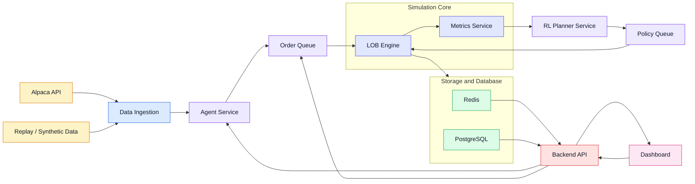

# Project ISA - Agentic Trading Sandbox

CityUHK CS FYP 2027

A two-level co-adaptive framework for simulating financial markets. The lower level is a population of trading agents that submit orders to a central limit order book (LOB) matching engine acting as the virtual exchange. The upper level is a reinforcement-learning exchange planner that observes the market as a whole and adjusts its policy in response to the population's evolving behaviour.

The design principle throughout is a **strict separation between the single-writer matching engine and the many concurrent agents around it**, so that concurrency never compromises the correctness of order matching.

This document mirrors the project design (Architecture Overview, and the Major Technical Components / Figure 1 sections).

## Architecture Diagram



The system is organized into three layers: a **simulation core** that hosts the market and its agents, a **data and persistence layer** that feeds and records the simulation, and a **frontend layer** that makes the simulation observable and controllable in real time.

## Major Components

### Data Ingestion Pipeline

Feeds the rest of the system with external market data and converts it into a format the simulation engine can run. Market data is accessed through the official **Alpaca Python SDK** via REST (historical data, recovery of missing information) and WebSocket (continuous stream of trades, quotes, and market updates).

- **Replay and Synthetic Flow Generator** — an alternative to live market data. Historical data can be replayed for repeatable experiments, while synthetic order flow simulates specific conditions such as high volatility, low volatility, or spoofing-like activity.
- **Data Normalizer and Book Seeder** — converts incoming data into a consistent internal format by standardizing timestamps, symbols, prices, quantities, and event types. Normalized data initializes or updates the simulated market.

### Simulation Core

The central part of the project, built primarily in Python for its integration with RL and data-processing libraries.

- **Limit Order Book (LOB) Matching Engine** — the virtual stock exchange. It stores outstanding buy and sell orders and matches them using **price-time priority**. The engine is the single source of truth for the simulated market state: agents may submit orders to it, but they cannot modify the book directly. This prevents race conditions and ensures all orders follow the same rules.
- **Market Metrics Aggregator** — turns order book activity into market-condition signals: volatility, bid-ask spread, liquidity depth, trading volume, cancellation rate, and order-to-trade ratio. Backed by **NumPy** and **Pandas** for fast calculation and aggregation. These metrics are consumed by agents, the RL planner, and the dashboard.

### Agent Pool and Order Queue

A service running trading agents and planners concurrently. RL agents are built on **Stable-Baselines3**, with **Gymnasium** defining how an agent observes, acts, and receives reward. Agents run concurrently and asynchronously via **asyncio**, submitting orders through a **Redis Streams** order queue to the single-writer matching engine.

Agent types:

| Agent               | Role                                                               |
| ------------------- | ------------------------------------------------------------------ |
| Market-making agent | Provides legitimate liquidity; represents normal HFT-style quoting |
| Momentum agent      | Represents sentiment-driven or hype-driven trading                 |
| Spoofing-like agent | Places and cancels misleading large orders                         |
| RL trading agent    | Learns a strategy without manually prescribing its behaviour       |
| RL exchange planner | Applies policy to regulate the market                              |

### Storage and Database

A two-tier storage system:

- **Redis** — the fast read layer. Stores the current order book, latest trades, market snapshots, agent states, and other frequently accessed data. Also carries the order queue from agents to the matching engine.
- **PostgreSQL** — long-term persistence. Retains order submissions, trade executions, cancellations, fee structures, planner adjustments, agent portfolio balances, and simulation evaluation metrics. These logs enable accurate replay of experimental runs, analytical visualizations, and empirical comparison between static and dynamic policy frameworks.

### Frontend Dashboard

The user-facing layer for monitoring and visualizing the whole system in real time, built with **Next.js** and **React**.

## Technology Stack

| Layer           | Technology                             |
| --------------- | -------------------------------------- |
| Simulation core | Python, NumPy, Pandas                  |
| RL agents       | Stable-Baselines3, Gymnasium, asyncio  |
| Data ingestion  | Alpaca Python SDK (REST + WebSocket)   |
| Storage         | Redis, PostgreSQL                      |
| API layer       | FastAPI                                |
| Frontend        | Next.js, React                         |
| Dev tooling     | OpenCode, Docker, TensorBoard, Bun, uv |

## Repository Structure

```
Codebase/
├── backend/                # Simulation backend (Python)
│   ├── app/
│   │   ├── main.py         # FastAPI API layer entrypoint
│   │   ├── config.py       # Settings from .env
│   │   ├── core/           # Simulation core: LOB engine, metrics aggregator
│   │   ├── ingestion/      # Replay/synthetic generator, normalizer/book seeder
│   │   ├── agents/         # Agent pool, Gymnasium env, order queue
│   │   └── storage/        # Redis fast layer, PostgreSQL persistence
│   ├── docker-compose.yml  # Redis + PostgreSQL containers
│   └── pyproject.toml      # uv-managed dependencies
└── frontend/               # Dashboard (Next.js + React, tRPC, Drizzle)
```

## Getting Started

Prerequisites: [Bun](https://bun.sh), [uv](https://docs.astral.sh/uv/), Docker, Python 3.12.

```bash
# 1. Start Redis and PostgreSQL (from backend/)
cd backend
docker compose up -d

# 2. Install backend Python dependencies
uv sync

# 3. Install frontend dependencies
cd ../frontend
bun install

# 4. Run both dev servers from the repo root
cd ..
bun dev
```

- Backend API: http://localhost:8000 (health check at `/health`, docs at `/docs`)
- Dashboard: http://localhost:3000

`bun dev` starts both servers concurrently. Individual servers can be run with `bun dev:frontend` and `bun dev:backend`.

Environment variables are configured via `backend/.env` (see `backend/.env.example`) and `frontend/.env` (see `frontend/.env.example`).
